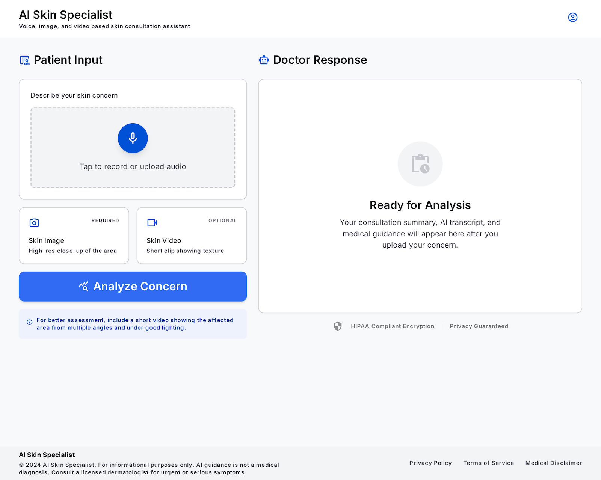
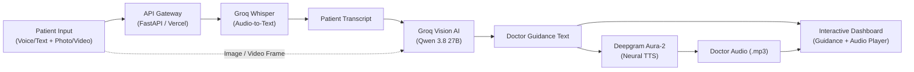

# 🩺 AI Skin Specialist

<p align="center">
  
</p>

<p align="center">
  <strong>Multimodal AI-Powered Dermatology Consultation Assistant</strong><br/>
  Combines Vision AI, Voice Transcription, and Conversational Text-to-Speech for Instant Skin Care Guidance.
</p>

<p align="center">
  <a href="https://python.org"></a>
  <a href="https://fastapi.tiangolo.com"></a>
  <a href="https://groq.com"></a>
  <a href="https://deepgram.com"></a>
  <a href="https://vercel.com"></a>
  <a href="https://tailwindcss.com"></a>
  <a href="LICENSE"></a>
</p>

<p align="center">
  <a href="https://vercel.com/new/clone?repository-url=https%3A%2F%2Fgithub.com%2FAnas262%2FAI-Skin-Specialist&env=GROQ_API_KEY,DEEPGRAM_API_KEY,GROQ_MODEL,DEEPGRAM_TTS_MODEL,WHISPER_MODEL">
    
  </a>
</p>

<p align="center">
  🌐 <strong>Live Demo:</strong> <a "https://dermasenseai.vercel.app/"><ai-skin-specialist.vercel.app</code></a>
  <br/>
</p>

---

## 🌟 Overview

**AI Skin Specialist** is an intelligent, privacy-first dermatology consultation assistant. Patients can describe their symptoms using their natural voice or text and upload skin photos or video clips. The system transcribes the patient's voice via **Groq Whisper**, inspects the skin lesion with high-speed **Groq Vision AI**, and generates authoritative, empathetic medical guidance delivered both as written text and spoken voice audio via **Deepgram Aura-2**.

### 💡 Key Features

- 🎙️ **Natural Voice Input**: Speak your skin concerns directly through browser microphone recording or file upload.
- 📸 **Multimodal Vision Analysis**: Powered by Groq's high-throughput Vision model (`qwen/qwen3.8-27b`) to analyze visual presentations, rashes, and acne.
- 🎥 **Video & Frame Extraction**: Accepts uploaded video clips, extracting high-fidelity keyframes automatically for assessment.
- 🔊 **Human-Like Doctor Voice Response**: Synthesizes lifelike spoken doctor guidance via Deepgram's `aura-2-thalia-en` neural TTS engine.
- 🖥️ **Dual Interface Support**:
  1. **Modern Responsive Web Dashboard**: Tailwind CSS frontend with dark/light visual clarity and integrated audio waveform player.
  2. **Gradio Workspace App**: Clean clinical Gradio interface for rapid local experimentation and Hugging Face Spaces deployment.
- ⚡ **Production & Serverless Ready**: Native FastAPI architecture pre-configured for **1-click Vercel deployment** with zero-overhead serverless functions.

---

## 🏗️ Architecture Flow



---

## 📁 Project Structure

```text
ai-skin-specialist/
|-- api/
|   `-- index.py                # Serverless FastAPI backend (Vercel & local)
|-- public/
|   `-- index.html              # Modern responsive Tailwind CSS dashboard
|-- index.html                  # Root static fallback
|-- run_dashboard.py            # Local one-command development server runner
|-- main.py                     # Gradio application entry point
|-- voice_of_the_patient.py     # Microphone recording and Groq Whisper transcription
|-- brain_of_the_doctor_groq.py # Groq Vision AI analysis & frame extraction
|-- brain_of_the_doctor.py      # Alternate MiniMax/Anthropic vision implementation
|-- voice_of_the_doctor.py      # Deepgram TTS voice generation
|-- free_text_to_speech.py      # Lightweight offline TTS utility (gTTS)
|-- vercel.json                 # Vercel serverless routing configuration
|-- requirements.txt            # Dependencies for Vercel deployment
|-- pyproject.toml              # Project metadata & uv dependencies
|-- uv.lock                     # Deterministic dependency lockfile
|-- .python-version             # Python version specification (3.11)
|-- .env.example                # Template for required API keys
`-- README.md                   # Project documentation
```

---

## ⚙️ Tech Stack & Models

| Component | Technology | Model / Version |
| :--- | :--- | :--- |
| **Speech-to-Text (STT)** | Groq Cloud | `whisper-large-v3` |
| **Vision & Medical Brain** | Groq Cloud | `qwen/qwen3.8-27b` |
| **Text-to-Speech (TTS)** | Deepgram API | `aura-2-thalia-en` |
| **Backend Framework** | FastAPI + Uvicorn | `>= 0.115.0` |
| **Frontend UI** | HTML5, Tailwind CSS, JavaScript | Responsive SPA |
| **Local Clinical App** | Gradio | `>= 6.19.0` |
| **Package Manager** | uv (Astral) | `>= 0.12.0` |

---

## 🚀 Quickstart & Local Setup

### 1. Prerequisites

- **Python 3.11+** installed.
- **[uv](https://astral.sh/uv)** package manager (recommended) or standard `pip`.
- **FFmpeg** installed on your system (for audio conversions and video frame extraction).

#### Install FFmpeg:
- **macOS**: `brew install ffmpeg`
- **Windows**: `choco install ffmpeg` or `scoop install ffmpeg`
- **Linux (Ubuntu/Debian)**: `sudo apt update && sudo apt install ffmpeg`

---

### 2. Clone and Install Dependencies

```bash
git clone https://github.com/Anas262/AI-Skin-Specialist.git
cd AI-Skin-Specialist

# Install all dependencies with uv (fastest)
uv sync

# Or using standard pip
pip install -r requirements.txt
```

---

### 3. Configure Environment Variables

Copy `.env.example` to `.env`:

```bash
cp .env.example .env
```

Open `.env` and fill in your API credentials:

```ini
# Required API Keys
GROQ_API_KEY=gsk_your_groq_api_key_here
DEEPGRAM_API_KEY=your_deepgram_api_key_here

# Model Configurations (Optional defaults)
WHISPER_MODEL=whisper-large-v3
GROQ_MODEL=qwen/qwen3.8-27b
DEEPGRAM_TTS_MODEL=aura-2-thalia-en
```

> 🔑 Get your API keys:
> - Groq API Key: [console.groq.com](https://console.groq.com)
> - Deepgram API Key: [console.deepgram.com](https://console.deepgram.com)

---

## 💻 Running the Application

You can run either the **Full-Stack Web Dashboard** or the **Gradio Workspace**:

### Option A: Web Dashboard (Recommended)

Start the local FastAPI server:

```bash
uv run python run_dashboard.py
```
*(Or via module: `uv run python -m uvicorn api.index:app --reload --port 8000`)*

Open your browser at:
👉 **[http://localhost:8000](http://localhost:8000)**

> [!IMPORTANT]
> Always access the dashboard through `http://localhost:8000` rather than opening `index.html` directly from your file explorer. Browsers require an active HTTP origin for microphone permissions and API communication.

---

### Option B: Gradio Application

If you prefer the standalone Gradio clinical interface:

```bash
uv run python main.py
```

Open your browser at:
👉 **[http://127.0.0.1:7860](http://127.0.0.1:7860)**

---

## ☁️ Deploying to Vercel

This repository is pre-configured with [vercel.json](file:///D:/AI%20Agent%20Projects/AI-SKIN-SPECIALIST/vercel.json) and [api/index.py](file:///D:/AI%20Agent%20Projects/AI-SKIN-SPECIALIST/api/index.py) for instant deployment:

1. Push your repository to GitHub:
   ```bash
   git add .
   git commit -m "Deploy AI Skin Specialist"
   git push origin main
   ```
2. Go to [vercel.com](https://vercel.com) and click **"Add New..." ➔ "Project"**.
3. Select your `AI-Skin-Specialist` repository and click **Import**.
4. In **Project Settings ➔ Environment Variables**, add:
   * `GROQ_API_KEY` = `your_groq_api_key`
   * `DEEPGRAM_API_KEY` = `your_deepgram_api_key`
   * `GROQ_MODEL` = `qwen/qwen3.8-27b`
   * `DEEPGRAM_TTS_MODEL` = `aura-2-thalia-en`
   * `WHISPER_MODEL` = `whisper-large-v3`
5. Click **Deploy**. Your app will be live with full serverless functionality!

---

## 📡 API Reference

### 1. Health Check
```http
GET /api/health
```
**Response:**
```json
{
  "status": "healthy",
  "app": "AI Skin Specialist",
  "services": {
    "groq": "configured",
    "deepgram": "configured"
  }
}
```

### 2. Consult Doctor
```http
POST /api/consult
```
**Form Data Parameters:**
- `image` *(File, optional if video frame provided)*: Skin image (`.jpg`, `.png`).
- `audio` *(File, optional if text provided)*: Patient voice note (`.mp3`, `.wav`, `.webm`).
- `text` *(String, optional if audio provided)*: Patient textual description of the symptom.

**Response:**
```json
{
  "success": true,
  "transcript": "I have mild irritation and redness on my forehead.",
  "guidance": "I see the mild irritation on your forehead. It is advisable to use a gentle fragrance-free cleanser, apply a soothing moisturizer, and protect the area from sun exposure.",
  "audio": "data:audio/mp3;base64,SUQzBAAAAAAAI1..."
}
```

---

## ⚖️ Medical Disclaimer

> [!CAUTION]
> **AI Skin Specialist provides general educational and informational guidance only.**
> It is not a clinical medical device, cannot make a definitive diagnosis, and does not replace consultation, diagnosis, or treatment by a licensed physician or dermatologist. If you experience severe pain, rapidly spreading rash, bleeding, fever, or an emergency, consult a doctor immediately.

---

## 📜 License

Distributed under the **MIT License**. See `LICENSE` for more information.

---

<p align="center">
  Developed with ❤️ by <a href="https://github.com/Anas262">Anas Khan</a>
</p>
